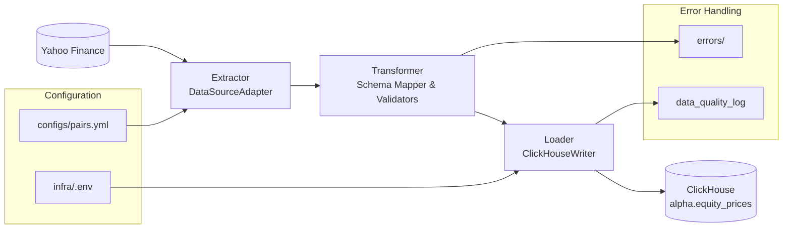

# ETL Design: Yahoo Finance OHLCV → ClickHouse

## 1. Executive Summary

- **Goal:** Collect OHLCV time series from Yahoo Finance and load into ClickHouse for backtesting.
- **Out of scope (now):** Feature engineering (e.g., triple-barrier), signal generation, execution simulation.
- **Primary Target:** `alpha.equity_prices` table with existing schema
- **Data Source:** Yahoo Finance API via `yfinance` library
- **Deployment:** Docker containerized with existing `infra/.env` configuration

## 2. Architecture Overview

- **Flow:** Yahoo Finance (API/library) → Extract → Normalize/Validate → Batch/Upsert → ClickHouse.
- **Diagram (Mermaid):**



**Rationale:** Minimal moving parts, easy to extend with additional sources later. Pluggable adapter pattern enables future expansion to Polygon, Tiingo, or other data providers.

## 3. Non-Functional Requirements (NFRs)

- **Extensibility:** New sources via `DataSourceAdapter` interface
- **Containerisation:** One-shot and scheduled runs via Docker
- **Config/Sec:** Read ClickHouse creds from `infra/.env` via dotenv
- **Observability:** Structured logs; basic metrics (rows/s, duration)
- **Cost:** Optimize retrieval/storage costs (see §10)
- **Idempotency:** Safe to re-run without duplicates
- **Rate Limiting:** Respect Yahoo Finance API limits (2000 requests/hour)

## 4. Target Stack & Folder Layout

**Language:** Python 3.11+

**Persistence:** ClickHouse (existing schema in `infra/`)

**Suggested layout:**

```
etl/
  adapters/
    yahoo_finance_adapter.py
    base_adapter.py
  io/
    clickhouse_client.py
  transforms/
    ohlcv_mapper.py
    validators.py
  configs/
    pairs.yml
  jobs/
    backfill_ohlcv.py
    incremental_ohlcv.py
  utils/
    env.py
    logging.py
  errors/
    quarantine_bad_data/
docs/
  etl-ohlcv-yahoo-clickhouse.md  <-- this file
infra/
  .env  (DO NOT recreate)
  docker-compose.yml
  clickhouse/...
```

**Why this layout:** Clear boundaries for adapters, I/O, and transforms. Separation of concerns enables independent testing and future extensions.

## 5. Interfaces & Abstractions

### 5.1 Data Source Adapter (extensible)

**Purpose:** Uniform extraction contract.

**Interface (pseudo):**

```python
from typing import Protocol, Optional
import pandas as pd
from datetime import datetime

class DataSourceAdapter(Protocol):
    def fetch_ohlcv(
        self,
        symbol: str,
        start: datetime,
        end: datetime,
        interval: str
    ) -> pd.DataFrame:
        """
        Return df[timestamp, open, high, low, close, volume]
        in UTC, no gaps, no duplicates.

        Args:
            symbol: Ticker symbol (e.g., 'AAPL')
            start: Start datetime (UTC)
            end: End datetime (UTC)
            interval: Data interval ('1d', '1h', '5m', etc.)

        Returns:
            DataFrame with columns: timestamp, open, high, low, close, volume
        """
        ...

class YahooFinanceAdapter:
    def __init__(self, rate_limit_delay: float = 0.1):
        self.rate_limit_delay = rate_limit_delay

    def fetch_ohlcv(self, symbol: str, start: datetime, end: datetime, interval: str) -> pd.DataFrame:
        # Implementation using yfinance library
        # Handle pagination, rate limits, timezone conversion
        pass
```

**YahooFinanceAdapter notes:**

- Pagination/rate limits (2000 req/hour)
- Exponential backoff for failures
- Canonical timezone conversion to UTC
- Handle market holidays and gaps

### 5.2 ClickHouse I/O Interface (reusable)

**Interface (pseudo):**

```python
from typing import Optional
import pandas as pd
from datetime import datetime

class ClickHouseClient:
    def __init__(self, host: str, port: int, user: str, password: str, database: str):
        self.connection_params = {...}

    def upsert_ohlcv(self, df: pd.DataFrame, table: str = "alpha.equity_prices") -> int:
        """
        Upsert OHLCV data into ClickHouse table.
        Returns number of rows inserted.
        """
        ...

    def latest_timestamp(self, symbol: str, table: str = "alpha.equity_prices") -> Optional[datetime]:
        """
        Get latest timestamp for a symbol to enable incremental loading.
        """
        ...

    def healthcheck(self) -> bool:
        """
        Verify ClickHouse connectivity and table access.
        """
        ...

    def get_data_quality_stats(self, symbol: str, start_date: datetime, end_date: datetime) -> dict:
        """
        Get data quality metrics for validation.
        """
        ...
```

**Upsert pattern:** Use `ReplacingMergeTree` engine with `(symbol, timestamp)` as primary key for automatic deduplication.

## 6. Configuration & Secrets

**Source of truth:** `infra/.env` (e.g., `CLICKHOUSE_HOST`, `CLICKHOUSE_PORT`, `CLICKHOUSE_USER`, `CLICKHOUSE_PASSWORD`, `CLICKHOUSE_DB`).

**Loading:** dotenv in `utils/env.py`; never write or duplicate `.env`.

**Runtime params:** `configs/pairs.yml` (symbols, intervals, trading calendars).

**Example configs/pairs.yml:**

```yaml
symbols:
  - symbol: "AAPL"
    exchange: "NASDAQ"
    start_date: "2020-01-01"
    interval: "1d"
  - symbol: "MSFT"
    exchange: "NASDAQ"
    start_date: "2020-01-01"
    interval: "1d"
  - symbol: "SPY"
    exchange: "NYSE"
    start_date: "2020-01-01"
    interval: "1d"

intervals:
  - "1d" # Daily data
  - "1h" # Hourly data (for intraday strategies)
  - "5m" # 5-minute data (for high-frequency)

trading_calendar:
  timezone: "America/New_York"
  holidays: "NYSE" # Use pandas_market_calendars
```

## 7. Data Model & Mapping

**Existing schema:** `alpha.equity_prices` table from `infra/migrations/releases/V2__create_backtesting_tables.sql`

**Field mapping table:**

| Source | Target Column  | Type          | Notes                      |
| ------ | -------------- | ------------- | -------------------------- |
| ts     | timestamp      | DateTime64(3) | UTC, millisecond precision |
| open   | open           | Decimal64(4)  | >= 0; NaN rejected         |
| high   | high           | Decimal64(4)  | high >= max(open, close)   |
| low    | low            | Decimal64(4)  | low <= min(open, close)    |
| close  | close          | Decimal64(4)  | non-negative               |
| volume | volume         | UInt64        | default 0 if missing       |
| symbol | symbol         | String        | normalized ticker          |
| -      | exchange       | String        | from config                |
| -      | adjusted_close | Decimal64(4)  | calculated if needed       |
| -      | created_at     | DateTime64(3) | auto-generated             |

**Dedup strategy:** `ReplacingMergeTree` on `(symbol, timestamp)` with automatic deduplication.

**Partitioning:** By month using `toYYYYMM(timestamp)` for efficient querying and storage management.

## 8. Job Types & Scheduling

### 8.1 Backfill Job

- **Purpose:** Load historical data for bounded range
- **Chunking:** By month/week to control costs & API limits
- **Example:** `python jobs/backfill_ohlcv.py --symbols AAPL,MSFT --start 2020-01-01 --end 2024-01-01`

### 8.2 Incremental Job

- **Purpose:** Load new data since last run
- **Logic:** `from latest_timestamp(symbol) + 1 interval to now`
- **Idempotency:** Safe to re-run multiple times
- **Example:** `python jobs/incremental_ohlcv.py --symbols AAPL,MSFT`

### 8.3 Orchestration

- **Start:** Simple cron in Docker
- **Future:** Consider Cadence/Temporal for complex workflows
- **Example cron:** `0 6 * * 1-5` (6 AM weekdays)

## 9. Error Handling, Idempotency, Validation

### 9.1 Validation Rules

```python
def validate_ohlcv_data(df: pd.DataFrame) -> List[str]:
    errors = []

    # Monotonic timestamps
    if not df['timestamp'].is_monotonic_increasing:
        errors.append("Timestamps not monotonic")

    # OHLC bounds
    invalid_high = df['high'] < df[['open', 'close']].max(axis=1)
    invalid_low = df['low'] > df[['open', 'close']].min(axis=1)

    if invalid_high.any():
        errors.append("High price below open/close")
    if invalid_low.any():
        errors.append("Low price above open/close")

    # Non-negative values
    if (df[['open', 'high', 'low', 'close']] < 0).any().any():
        errors.append("Negative prices found")

    return errors
```

### 9.2 Idempotency Keys

- **Primary key:** `(symbol, timestamp)` pair
- **Deduplication:** Automatic via `ReplacingMergeTree`

### 9.3 Retries/Backoff

- **Network failures:** Exponential backoff (1s, 2s, 4s, 8s)
- **Rate limits:** Respect Yahoo Finance limits with delays
- **ClickHouse failures:** Retry transient errors up to 3 times

### 9.4 Poison-pill Handling

- **Quarantine:** Bad batches to `errors/quarantine_bad_data/`
- **Logging:** Sample payloads and reasons in structured logs
- **Alerting:** Notify on repeated failures

## 10. Performance & Cost Considerations

### 10.1 Retrieval Costs

- **Batching:** Process symbols sequentially to respect rate limits
- **Caching:** Store last-run watermark to avoid re-pulls
- **Efficiency:** Use `yfinance` library's built-in caching

### 10.2 Insert Costs

- **Columnar insert:** Use ClickHouse's native format
- **Batch size:** 10k–100k rows per batch for optimal performance
- **Fewer commits:** Batch multiple symbols in single transaction

### 10.3 Storage Costs

- **Partitioning:** By month using `toYYYYMM(timestamp)`
- **Ordering:** `(symbol, timestamp)` for efficient range queries
- **Compression:** ClickHouse defaults (LZ4) provide good compression
- **TTL:** 10-year retention as per existing schema

### 10.4 Compute Costs

- **Off-peak runs:** Schedule during low-traffic hours
- **Async inserts:** Consider `async_insert` for high-throughput scenarios
- **Resource limits:** Docker memory/CPU constraints

## 11. Containerisation

### 11.1 Docker Image

```dockerfile
FROM python:3.11-slim

WORKDIR /app

# Install dependencies
COPY requirements.txt .
RUN pip install --no-cache-dir -r requirements.txt

# Copy application code
COPY etl/ ./etl/
COPY configs/ ./configs/

# Create non-root user
RUN useradd -m -u 1000 etluser && chown -R etluser:etluser /app
USER etluser

# Health check
HEALTHCHECK --interval=30s --timeout=10s --start-period=5s --retries=3 \
    CMD python -c "from etl.io.clickhouse_client import ClickHouseClient; ClickHouseClient().healthcheck()"

ENTRYPOINT ["python", "etl/jobs/incremental_ohlcv.py"]
```

### 11.2 Runtime Configuration

- **Mount:** Read-only `infra/.env`
- **Network:** Connect to ClickHouse service
- **Volumes:** Persistent error logs and quarantine data

### 11.3 Docker Compose Integration

```yaml
services:
  etl:
    build: .
    env_file: infra/.env
    depends_on:
      - clickhouse
    volumes:
      - ./errors:/app/errors:rw
      - ./logs:/app/logs:rw
    restart: unless-stopped
```

## 12. Observability

### 12.1 Logging

```python
import structlog

logger = structlog.get_logger()

def log_etl_run(symbol: str, interval: str, rows: int, duration: float, errors: List[str]):
    logger.info(
        "etl_run_completed",
        symbol=symbol,
        interval=interval,
        rows_processed=rows,
        duration_seconds=duration,
        errors=errors,
        run_id=uuid.uuid4()
    )
```

### 12.2 Metrics (Optional)

- **Rows/second:** Throughput measurement
- **Latency histograms:** API response times
- **Error rates:** Failed requests percentage
- **Storage usage:** ClickHouse table sizes

### 12.3 Data Lineage

- **Source tracking:** Record `yfinance` version and adapter version
- **Run metadata:** `run_id`, `ingest_ts`, `source_adapter`
- **Quality metrics:** Store in `alpha.data_quality_log`

## 13. Security

### 13.1 Secrets Management

- **Source:** Only from `infra/.env`
- **No hardcoding:** No secrets in images or code
- **Environment isolation:** Separate dev/staging/prod configs

### 13.2 ClickHouse Access

- **Least privilege:** Dedicated user with insert/select only on target tables
- **Network security:** Internal Docker network communication
- **Authentication:** Use ClickHouse's built-in user management

## 14. Test Strategy

### 14.1 Unit Tests

```python
def test_yahoo_finance_adapter():
    adapter = YahooFinanceAdapter()
    df = adapter.fetch_ohlcv("AAPL", start, end, "1d")

    assert "timestamp" in df.columns
    assert "open" in df.columns
    assert df["timestamp"].dt.tz is None  # UTC timezone
    assert not df.duplicated(subset=["timestamp"]).any()

def test_ohlcv_validator():
    # Test validation rules
    pass

def test_clickhouse_client():
    # Test connection and basic operations
    pass
```

### 14.2 Integration Tests

- **Docker-compose:** Full stack with ClickHouse
- **Golden files:** Sample data snapshots for regression testing
- **End-to-end:** Complete ETL pipeline validation

### 14.3 Smoke Tests

- **Backfill:** 1-week window, assert rowcount & no dup keys
- **Incremental:** Verify latest timestamp tracking
- **Error handling:** Test with invalid symbols/data

## 15. Risks & Mitigations

| Risk                          | Mitigation                                              |
| ----------------------------- | ------------------------------------------------------- |
| API instability / rate limits | Exponential backoff; caching; bounded concurrency       |
| Schema drift                  | Versioned mappers; CI check against ClickHouse metadata |
| Clock skew                    | Always UTC; rely on server time for ingest_ts           |
| Data quality issues           | Validation rules; quarantine bad data; alerting         |
| Storage growth                | TTL policies; partitioning; compression                 |
| Network failures              | Retry logic; circuit breakers; health checks            |

## 16. Roadmap

### 16.1 Next Phase

- **Additional sources:** Polygon, Tiingo, Alpha Vantage adapters
- **Corporate actions:** Dividend and split data ingestion
- **Trading calendars:** Market hours and holiday handling

### 16.2 Future Enhancements

- **Feature pipelines:** Triple-barrier labels, technical indicators
- **Streaming:** Kafka ingestion for real-time data
- **Orchestration:** Cadence/Temporal for complex workflows
- **ML integration:** Feature store for model training

## 17. Acceptance Criteria (Definition of Done)

### 17.1 Functional Requirements

- [ ] Backfill job loads historical data for specified symbols and date ranges
- [ ] Incremental job loads new data since last run without duplicates
- [ ] Data validation prevents invalid OHLCV records from being inserted
- [ ] Error handling quarantines bad data and logs issues
- [ ] ClickHouse upsert works with existing `alpha.equity_prices` schema

### 17.2 Technical Requirements

- [ ] Clear interfaces for `DataSourceAdapter` and `ClickHouseClient`
- [ ] Docker containerization with `infra/.env` configuration
- [ ] One Mermaid diagram showing data flow
- [ ] Complete field mapping table to existing schema
- [ ] Test plan covering unit, integration, and smoke tests
- [ ] Cost considerations documented for retrieval, storage, and compute

### 17.3 Operational Requirements

- [ ] Structured logging with run metadata
- [ ] Health checks for ClickHouse connectivity
- [ ] Rate limiting and retry logic for API calls
- [ ] Data quality metrics stored in `alpha.data_quality_log`
- [ ] Documentation for deployment and monitoring

### 17.4 Security Requirements

- [ ] No secrets in code or Docker images
- [ ] Least privilege ClickHouse user configuration
- [ ] Secure environment variable handling
- [ ] Network isolation in Docker environment
